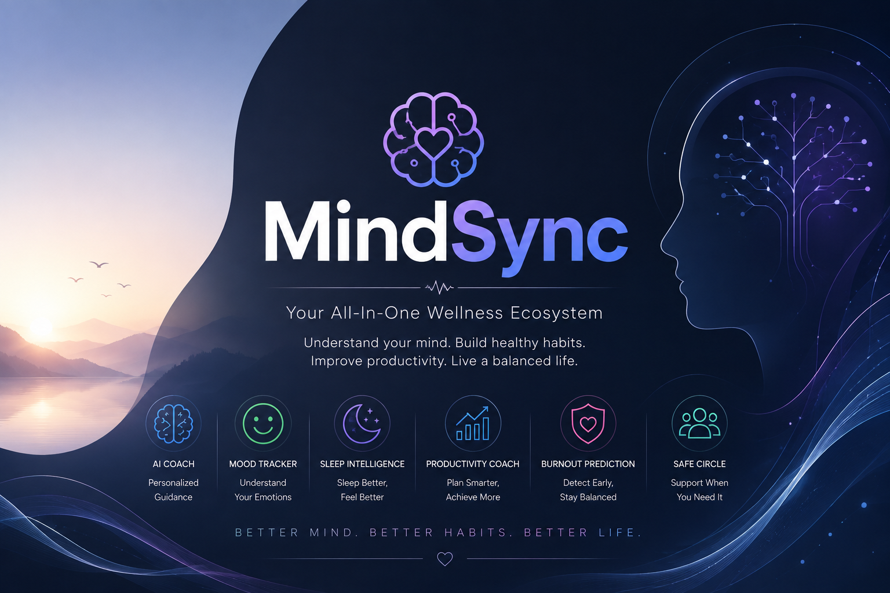

<div>

# 🧠 MindSync

<p align="center">
  
</p>

*An AI-powered wellness platform that combines mental health, productivity, sleep intelligence, healthy habits, burnout prediction, and personalized coaching into one intelligent ecosystem.*


</div>

---

# 📖 Overview

MindSync is an AI-powered digital wellness platform designed to help people build healthier, happier, and more balanced lives.

Instead of switching between multiple applications for mood tracking, journaling, productivity, sleep monitoring, healthy habits, and emotional support, MindSync combines everything into a single intelligent ecosystem.

By understanding users holistically, MindSync delivers personalized insights, burnout prediction, AI-powered coaching, and preventive wellness recommendations that adapt to each user's lifestyle.

---

## ✨ Features

- 🧠 **AI Wellness Companion** – Get personalized guidance and emotional support powered by AI.
- 😊 **Mood & Wellness Tracking** – Monitor emotions, habits, and overall well-being in one place.
- 🔥 **Burnout Prediction** – Detect stress patterns early with AI-driven preventive insights.
- 📊 **Smart Analytics Dashboard** – Visualize wellness trends, productivity, sleep, and progress.
- 📚 **AI Productivity Coach** – Plan tasks, manage schedules, and improve focus intelligently.
- 👨‍👩‍👧 **Safe Circle** – Connect with trusted contacts for wellness check-ins and emergency support.

---

# 🚀 Why MindSync?

Unlike traditional wellness applications that solve only one problem at a time, MindSync provides a holistic AI-powered ecosystem that connects mental wellness, physical health, productivity, healthy habits, and emotional support into one seamless experience.

The result is a platform that not only tracks user activity but also understands behavioral patterns and proactively recommends healthier actions.

---

# 🏗 System Architecture

```text
                User
                  │
                  ▼
        Next.js Frontend
                  │
                  ▼
        Node.js + Express API
                  │
        ┌─────────┴─────────┐
        ▼                   ▼
   Gemini AI          MongoDB Database
        │                   │
        └─────────┬─────────┘
                  ▼
      Personalized Wellness Engine
                  │
                  ▼
         Analytics Dashboard
```

---

# ⚙️ Tech Stack

### Frontend

- Next.js
- React
- Tailwind CSS
- TypeScript

### Backend

- Node.js
- Express.js

### Database

- PostgreSQL

### Artificial Intelligence

- Groq API
- Emotion Classification Models
- Recommendation Engine

### Authentication

- Firebase Authentication

### Charts

- Chart.js
- Recharts

---

# 📂 Project Structure

```text
MindSync
│
├── app
├── components
├── pages
├── hooks
├── services
├── api
├── models
├── controllers
├── routes
├── middleware
├── database
├── utils
├── assets
├── public
└── README.md
```

---

# ✨ WOW Features

- Smartwatch Integration
- Calendar Sync
- AI Voice Companion
- Therapist Dashboard
- University Dashboard
- Workplace Wellness Analytics
- Community Support Groups
- Multilingual Support

---

# 📈 Expected Impact

✅ Improve mental well-being

✅ Encourage healthy habits

✅ Detect burnout early

✅ Increase productivity

✅ Reduce screen addiction

✅ Promote preventive wellness

---

# 🏆 Buildathon 2026

MindSync was developed as part of **Buildathon 2026**, focusing on creating an innovative AI-powered wellness ecosystem that addresses real-world challenges through intelligent, personalized, and preventive technology.

---

# 👩‍💻 Author

**Nidhi Patil**

B.Tech Student • AI & Full Stack Developer

---

# 📄 License

This project is licensed under the MIT License.

---

<div align="center">

### ⭐ If you found this project interesting, consider giving it a Star!

**Built with ❤️ for Buildathon 2026**

</div>
